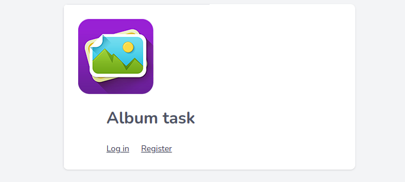
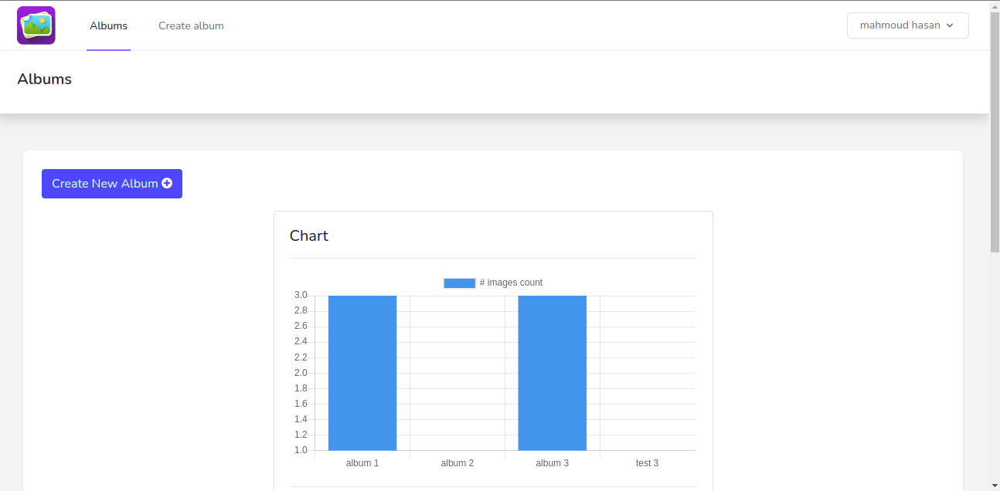
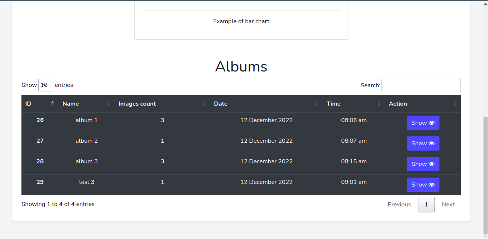
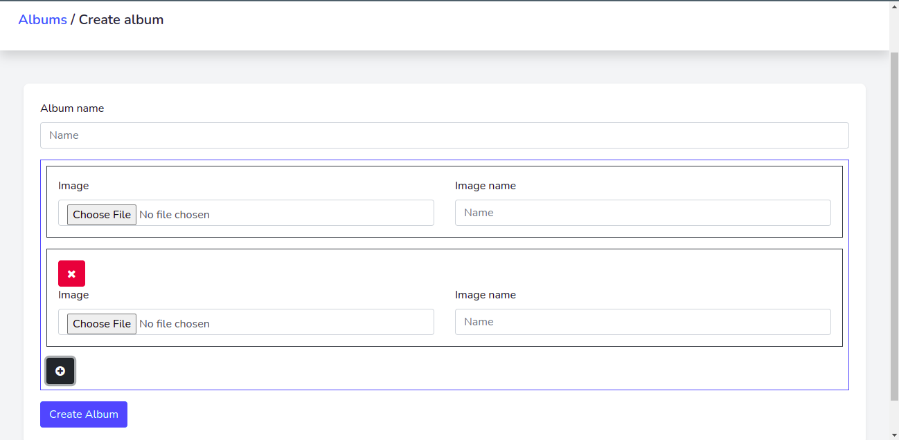
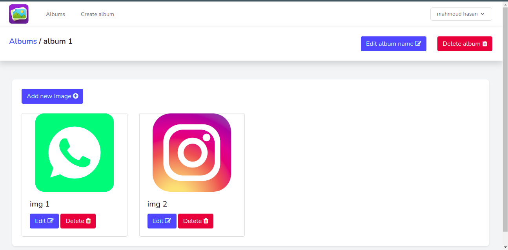
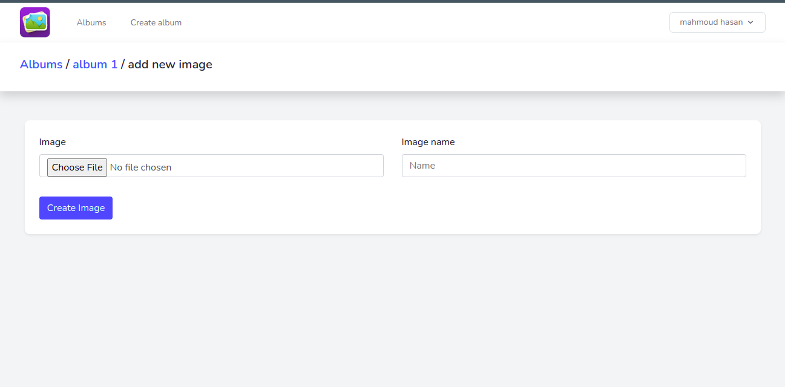
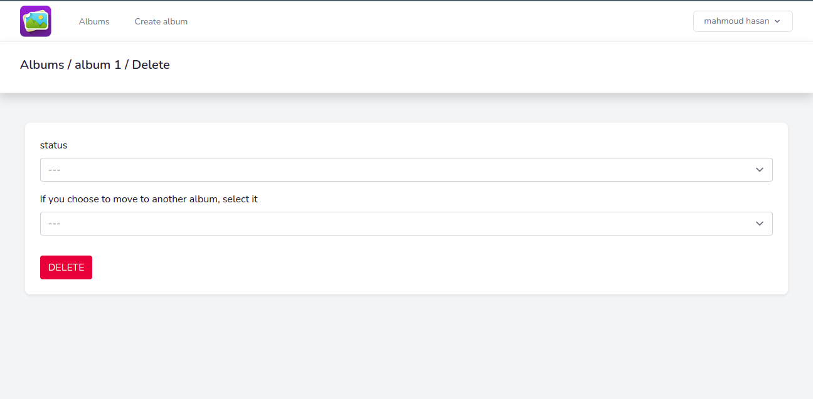

## Album Task Require 

- PHP 8.1

## Album Task Run 

- git clone https://github.com/M-H-Abdelfadeil/album_task.git
- copy file .env.example to .env 
- create database and set data server , database name in file  .env
- composer install 
- php artisan key:generate
- php artisan migrate
- php artisan storage:link
- php artisan serve 

## Project 

